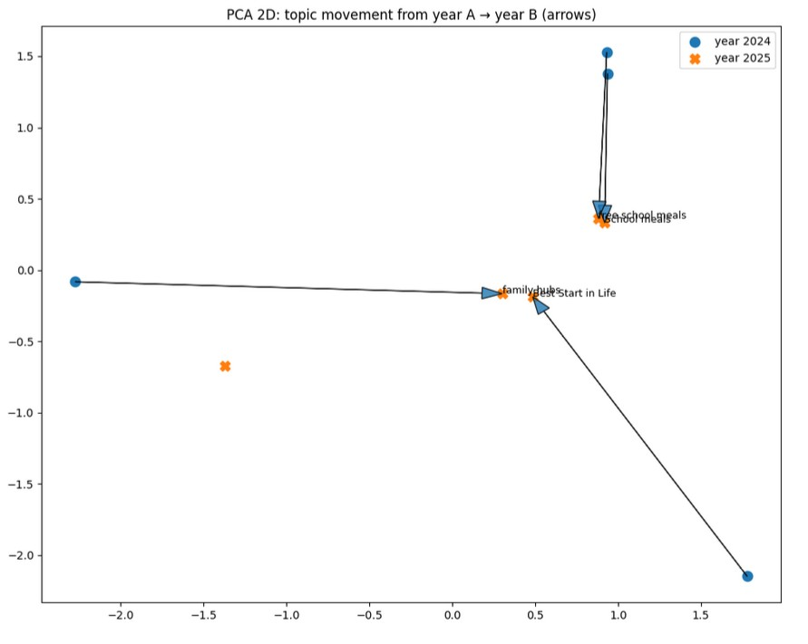

# Who are we? 

We are a group of data scientists at a datathon using commoncrawl data to solve a problem hosted by Bristol University and the [commoncrawl project](https://www.urbaneconomies.co.uk/datathon.html#datathon-materials).

This repository contains all our code.

Our team members: Meng Le Zhang, Aditi Dutta, Esha Sadia Nasir, Mariam Cook, Helena Byrne and Wong E Chern.

# What was the datathon problem?

> This is a cache of web data, which contains all the UK governmental webpages (.gov.uk) that have been archived by the Common Crawl in two points in time: February-March 2024 (part 1 and part 2 same as Problem 4) and October 2025. Identify changes in a specific policy domain associated with the new government elected in July 2024.


# What did we do?

To tackle the problem, we first:

- Targeted our searched. We had 2.4 million website entries in the raw WET file. To look at policies, we explicitly filtered our data to website in the `gov.uk/government/news` subdomain. This is where new policies are announced. This gives us roughly to 3000 webpages. 

To analyse the webiste content, we took two approach:
- Target approached. We had a 'seed' of 12 policy names or terms. We filtered our data to only webpages that mentioned these terms. Then we generated embeddings to look at differences in context for the same terms across time.
- LLM approach to read documents and classify any policy instruments into certain categories (used over a VM supplied by datathon). Then we compared differences in classifications over time. 

# What did we find:

## Classifications:

<iframe src="docs/policy type over time.html" width="800" height="600" style="border:none;"></iframe>

This plot shows the difference over time in the types of policy instruments that are announced. We use data from 2739 LLM classified webpages. 

<iframe src="docs/classification 2024 vs 2025.html" width="800" height="600" style="border:none;"></iframe>

We found that the `gov.uk/government/news` website included webpages from before 2024 so we had to filter by the year a page is published.

## Embediing

The seed policy terms that we wanted to look at were 

```
“Best Start in Life”
Sure Start
Family Hub
Net Zero
Healthy Start Vouchers
Child
Children
Tax-Free Childcare
Universal Credit childcare
Free Childcare for Working Parents
Babies
Infants
School meals
Free school meals
Breakfast clubs
Free breakfast club
Vitamins
Fresh fruit and veg
Nutrients
Health visitor
Development checks
School readiness
Literacy
Numeracy
Digital literacy
Clean air
```


Helena manually checked the websites to check the frequency of policy mentions.


Cosine similarity shows the similarity of the context that the words are mentioned in.



Best Start in Life is closer to Family Hubs. This is likely due to announcement of FH under BSIL mission and renewed funding for Family Hubs. 

## What else we tried

- We validated the LLM results/ classifications. We found the LLM will summarise irrelevant text from headers, footers that were not apparent in the WET files 


- We mapped the postcodes associated with organisation in government. 


# What did we learn?

- The raw files are very large -- we used `polars` library to only read in read specific lines of the data that match our subdomain url.